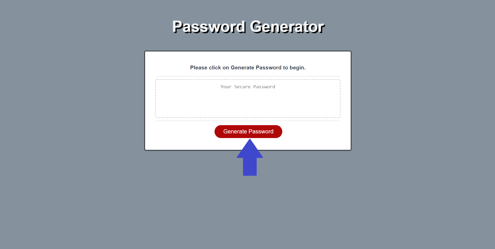
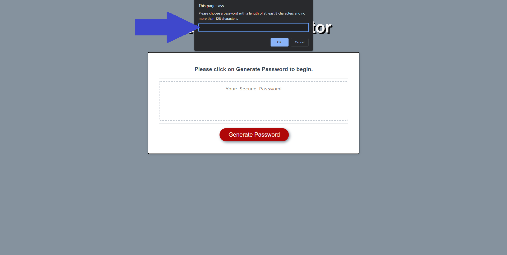
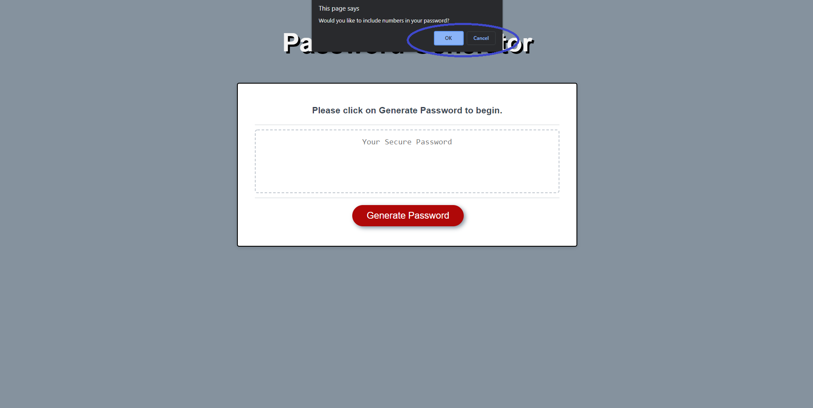
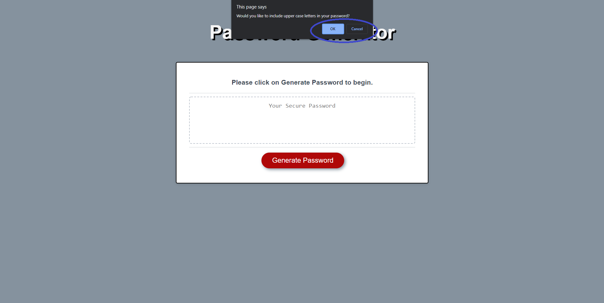
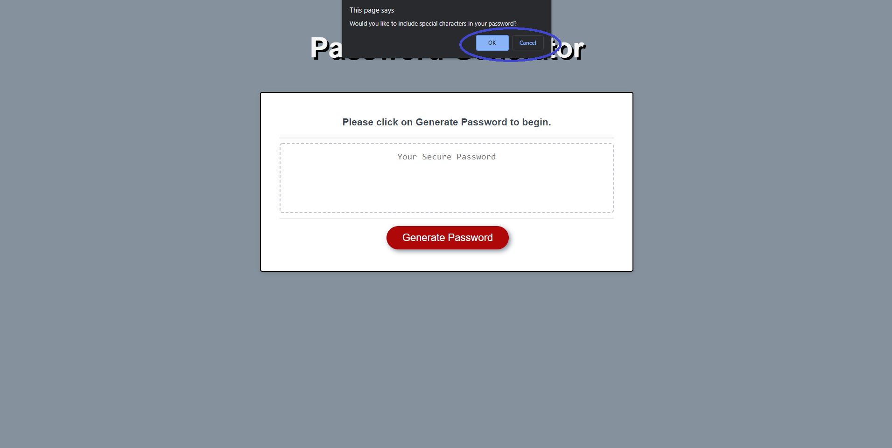
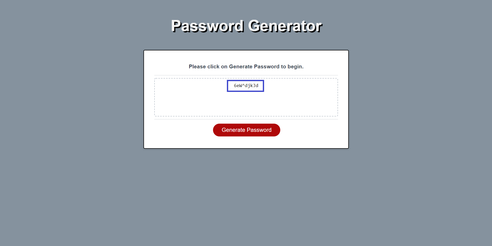

# Password-Generator

## Description
This project was created to assist employees in creating a randomly generated password that meets the crieria of their choosing. This helps the employees cut down time spent choosing a strong password and prevents the same password being generated more than once.

I also created this project to demonstrate what I've learned to do with JavaScrip. It was extreamly exciting to ```console.log()``` a function or array and get the expected log. As well as motivating to see the error after it did not log what was expected and then working out the solution. The most interesting part of the project was learning at the end how all the functions, variables and objects have to connect in order for the code to work.

## Instructions

You can find the deployed application here&mdash;https://israelmrios.github.io/Password-Generator/

### Step 1
```
Select 'Generate Password' to begin the window prompt of questions.
```


### Step 2
```
Select the desired length of your password.
```


### Step 3
```
Select if you would like numbers in your password.
```


### Step 4
```
Select if you would like lowercase letters in your password.
```


### Step 5
```
Select if you would like uppercase letters in your password.
```


### Step 6
```
Select if you would like special characters in your password.
```


### Given Password
```
Voilà randomly generated password with chosen characters is given and displayed in page.
```


## Resources Used
* [GitHub](http://github.com)
* [MDN Web Docs](https://developer.mozilla.org)
* [W3 Schools](https://www.w3schools.com/)
* [JavaScript Cheat Sheet](https://websitesetup.org/javascript-cheat-sheet/)
* [Request-Response](https://coding-boot-camp.github.io/full-stack/github/professional-readme-guide)

## License
MIT License
Copyright (c) [2021] [Israel M. Rios]